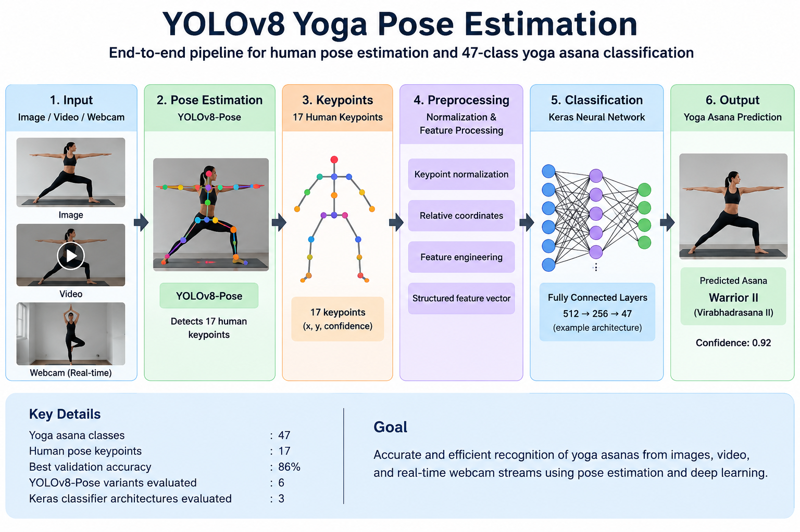

# YOLOv8 Yoga Pose Estimation

**End-to-end human pose estimation and 47-class yoga asana classification using YOLOv8-Pose, keypoint engineering and Keras.**

This project investigates human pose estimation and yoga asana recognition from images, video, and real-time webcam streams.

The system combines YOLOv8-Pose for human keypoint detection with a custom Keras-based classifier for yoga asana recognition.

## Pipeline

**Image / Video / Webcam**  
↓  
**YOLOv8-Pose**  
↓  
**17 Human Keypoints**  
↓  
**Keypoint Normalization & Feature Processing**  
↓  
**Keras Neural Network Classifier**  
↓  
**47 Yoga Asana Classes**

## Architecture Diagram


## Results at a Glance

| Component | Result |
|---|---:|
| Yoga asana classes | **47** |
| Human pose keypoints | **17** |
| Best recorded validation accuracy | **70.35%** |
| YOLOv8-Pose variants evaluated | **6** |
| Keras classifier architectures evaluated | **3** |

## Quick Start

Clone the repository and install the required dependencies:

```bash
git clone https://github.com/ssarswat/yolov8-yoga-pose-estimation.git
cd yolov8-yoga-pose-estimation
python -m venv .venv
.venv\Scripts\activate
pip install -r requirements.txt
jupyter notebook
```
Then open:

`notebooks/Yoga Pose Estimation.ipynb`

> For Linux/macOS, replace `.venv\Scripts\activate` with `source .venv/bin/activate`.

## Overview

This project investigates human pose estimation for recognizing yoga practices from images, video, and real-time webcam streams.

The system combines YOLOv8-Pose for human keypoint detection with a custom Keras-based neural network for yoga asana classification. Pose keypoints extracted from YOLOv8-Pose are normalized and stored as structured data before being used for classification.

The study evaluates six YOLOv8-Pose variants across multiple Keras classifier architectures and examines the effect of dataset augmentation and class balancing on model performance.

The developed system was evaluated on validation data, open-source video, and real-time streaming video.

## Objectives

- Implement YOLOv8-Pose using transfer learning for yoga pose estimation.
- Extract and normalize human body keypoints from yoga images.
- Develop a Keras-based neural network for yoga asana classification.
- Investigate the effect of dataset imbalance and data augmentation.
- Compare different YOLOv8-Pose variants and Keras architectures.
- Evaluate the system on validation data, open-source video, and real-time webcam streams.

## System Pipeline

**Yoga Image Dataset**  
↓  
**Exploratory Data Analysis**  
↓  
**Class Imbalance Analysis**  
↓  
**Data Augmentation / Class Balancing**  
↓  
**YOLOv8-Pose Keypoint Detection**  
↓  
**Keypoint Extraction & Normalization**  
↓  
**Structured Keypoint Data (.CSV)**  
↓  
**Keras Neural Network**  
↓  
**47-Class Yoga Asana Classification**  
↓  
**Image / Video / Webcam Inference**

## Dataset

The dataset contains **47 yoga pose classes** organized into dedicated class folders.

Exploratory analysis identified an uneven distribution of images across the 47 classes, ranging from approximately **12 to 96 images per class**.

Data augmentation was employed to increase dataset diversity and address the effects of class imbalance.

## Models Evaluated

### YOLOv8-Pose Variants

Six YOLOv8-Pose variants were evaluated:

- YOLOv8n-Pose
- YOLOv8s-Pose
- YOLOv8m-Pose
- YOLOv8l-Pose
- YOLOv8x-Pose
- YOLOv8l-Pose-P6

### Keras Classifier Architectures

Three classifier configurations were evaluated:

1. `512 → 256 → 47`
2. `512 → 47`
3. `64 → 47`

The dense layers use ReLU activation and the output layer uses Softmax for 47-class yoga asana classification.

## Keypoint Processing

YOLOv8-Pose is used to extract human body keypoints from the input images.

The project processes the coordinates of **17 keypoints**, normalizes the coordinates to improve consistency across images, and stores the resulting keypoint data in CSV format together with the corresponding yoga pose class.

## Experimental Evaluation

The experiments compare:

- Different YOLOv8-Pose model variants
- Different Keras classifier architectures
- Original and augmented datasets
- Training and validation accuracy

The experiments were conducted to examine the relationship between model architecture, classifier configuration, dataset augmentation, and classification performance.

## Experimental Results

### Validation Accuracy — Original Dataset

| YOLOv8-Pose Model | 512 → 256 → 47 | 512 → 47 | 64 → 47 |
|---|---:|---:|---:|
| YOLOv8n | 69% | 70% | 67% |
| YOLOv8s | 73% | 75% | 73% |
| YOLOv8m | 82% | 82% | 80% |
| YOLOv8l | 85% | **86%** | 83% |
| YOLOv8x | 82% | 81% | 76% |
| YOLOv8l-Pose-P6 | 79% | 78% | 76% |

### Validation Accuracy — Augmented / Balanced Dataset

| YOLOv8-Pose Model | 512 → 256 → 47 | 512 → 47 | 64 → 47 |
|---|---:|---:|---:|
| YOLOv8n | 70% | 67% | 66% |
| YOLOv8s | 75% | 75% | 70% |
| YOLOv8m | 80% | 80% | 77% |
| YOLOv8l | 83% | 84% | 80% |
| YOLOv8x | **86%** | 85% | 83% |
| YOLOv8l-Pose-P6 | 82% | 82% | 77% |

### Key Findings

- The experiments demonstrate the effect of YOLOv8 model size and Keras classifier architecture on validation performance.
- The `512 → 256 → 47` architecture generally provided strong performance across the evaluated YOLOv8 variants.
- On the augmented/balanced dataset, **YOLOv8x-Pose with the `512 → 256 → 47` architecture achieved the highest reported validation accuracy of 86%**.
- On the original dataset, the highest reported validation accuracy was **86%**, achieved by YOLOv8l-Pose with the `512 → 47` architecture.
- The results demonstrate a trade-off between model complexity, classification performance, and computational requirements.
- Data augmentation improved validation accuracy for several configurations, although the effect varied across model variants and classifier architectures.

## Real-Time Evaluation

The developed system was evaluated using an open-source yoga instructional video and real-time streaming video.

The model demonstrated pose classification under variations including:

- Background and partial occlusion
- Minor pose variations
- Complex poses and unusual limb orientations
- Different practitioner attributes
- Multiple practitioners in a real-time scene

The evaluation included examples of correct classification despite occlusion and background variation, minor pose variations, complex limb orientations, and multiple practitioners performing the same pose.

## Software Environment

The implementation was developed using the following software stack:

- Python 3.9+
- TensorFlow 2.12+
- Keras 2.12+
- Ultralytics 8.0.140
- OpenCV 4.7+
- NumPy 1.23.5+
- Pandas 1.5.3+
- Matplotlib 3.6.3+
- Jupyter Notebook / Anaconda

## Technologies

**Programming:** Python

**Computer Vision:** YOLOv8-Pose, OpenCV

**Deep Learning:** TensorFlow, Keras

**Data Processing:** NumPy, Pandas

**Visualization:** Matplotlib

**Development Environment:** Jupyter Notebook, Anaconda

## Research Context

This project was undertaken as part of an **MS Data Science** research project focused on the evaluation of human pose estimation for yoga practices using computer vision.

The work combines human pose estimation, keypoint processing, neural-network classification, data augmentation, and real-time inference into an end-to-end experimental pipeline.

## Limitations and Future Directions

The research identifies several potential directions for further development:

- Advanced data augmentation techniques
- GAN-based synthetic data generation
- Multimodal approaches incorporating image and depth information
- Domain adaptation for improved generalization
- Further hyperparameter optimization
- Deployment on resource-constrained edge devices
- Improved real-time pose feedback and correction

## Repository Status

This repository presents the methodology, experimental results, and implementation context of the yoga pose estimation research project.

Additional notebooks, source code, datasets, visualizations, and selected experimental outputs will be added as the repository is progressively structured for reproducibility.

## Academic Reference

**Evaluation of Human Pose Estimation for Yoga Practices Using Computer Vision**

MS Data Science Research Project
